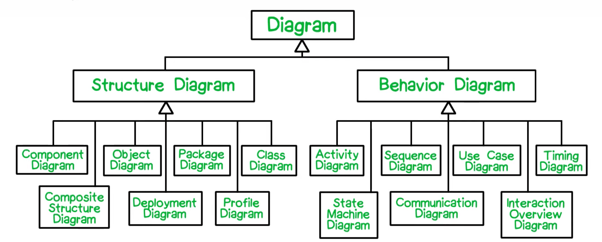
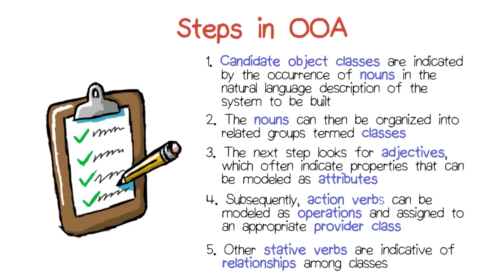
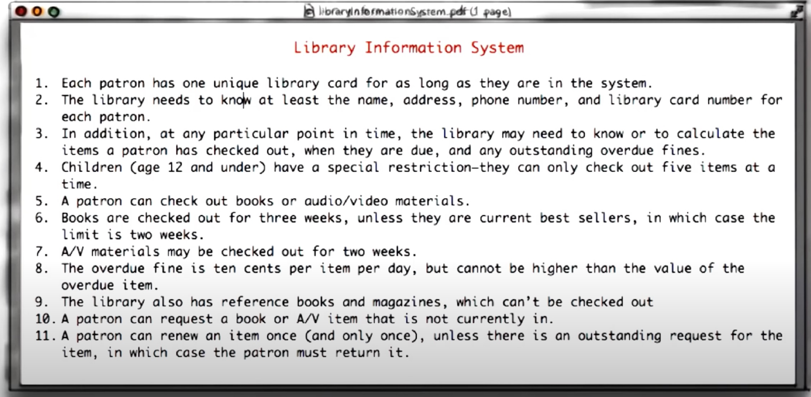
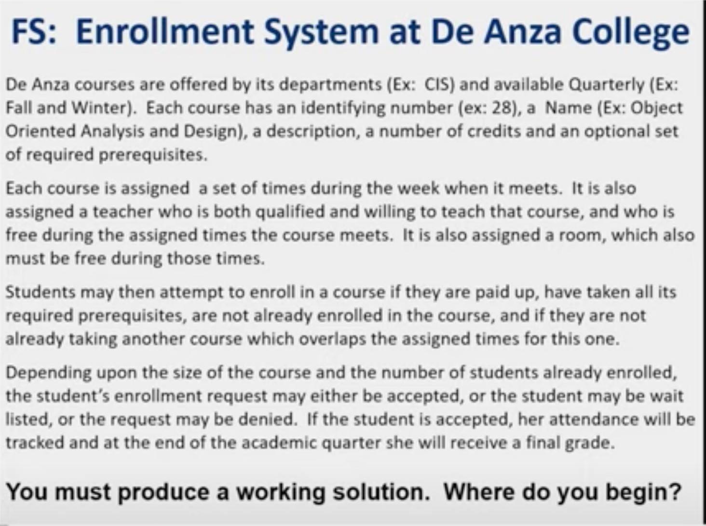
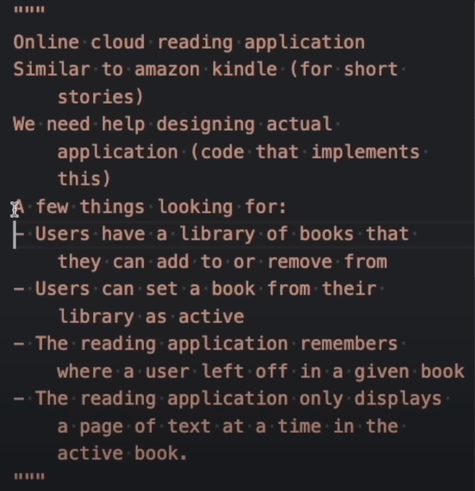
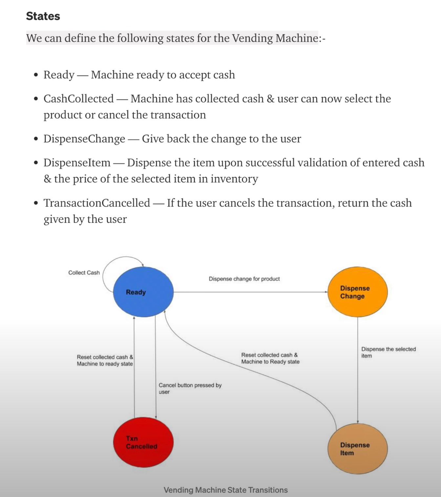

#  Software Architecture and Design Concepts

---

## Categories of UML Diagrams Used to Model Systems :

---
 ### Types of Relationships between Classes in OOAD

1. Inheritance (Is-A): Inheritance is a relationship between a superclass and a subclass, where the subclass inherits the properties and methods of the superclass. The subclass can also add new properties and methods or override the properties and methods of the superclass.

1. Composition (Has-A): Composition is a relationship between a whole and its parts, where the parts cannot exist without the whole. In this relationship, a class contains one or more instances of another class as its member variables.

1. Aggregation: Aggregation is a relationship between a whole and its parts, where the parts can exist without the whole. In this relationship, a class contains one or more instances of another class as its member variables, but the instances can exist independently of the containing class.

1. Association: Association is a relationship between two classes, where one class uses or interacts with the other class. This relationship can be one-to-one, one-to-many, or many-to-many.

1. Dependency: Dependency is a relationship between two classes, where one class depends on the other class to perform its function. This relationship is usually temporary and can change over time.

1. Realization: Realization is a relationship between a class and an interface, where the class implements the methods defined in the interface.

---
### \# Case : Relationships between People , Vehicles and Pollution Laws
 >Verbs help us in defining the relationsips between different UML Classes.

>People drive Vehicles , and Vehicle manufacturing can be affected by a change in the pollution laws .

1. **IS a Relationship** :  A car  -> is a  -> Vehicle  
2. **Association Relationship** : People-> drive ->Vehicles   
3. **Dependency Relationship** : Pollution  Laws -> affect -> Vehicles ( How they are produced , in terms of pollution control laws)
  
---

#### There are 2 types of `Operations` that can be performed by the defined Classes

+ **Pure Operations** : `Query Operations that don't state the change of any object` (Checking , Querying for information , without causing any side effects)
+ **Mutating Operations** : `Mutating Operations that change the state of objects`  
    + _These have 2 condition attributes_:  
        1. Pre-Conditions:  What should be true for this operation to be executed ( eg. Book must be available , to be issued)  
        2. Post-Conditions: What should mutate after this operation is executed ( eg. after a book is returned , the `isIssued` attribute should be set to false.)
    

### \# OOAD : Library Management System

---

### \# OOAD : College Enrolment System 

 

---

### \# OOAD : Online Cloud Reading App

 

---

 ### \# OOAD : Vending Machine

  